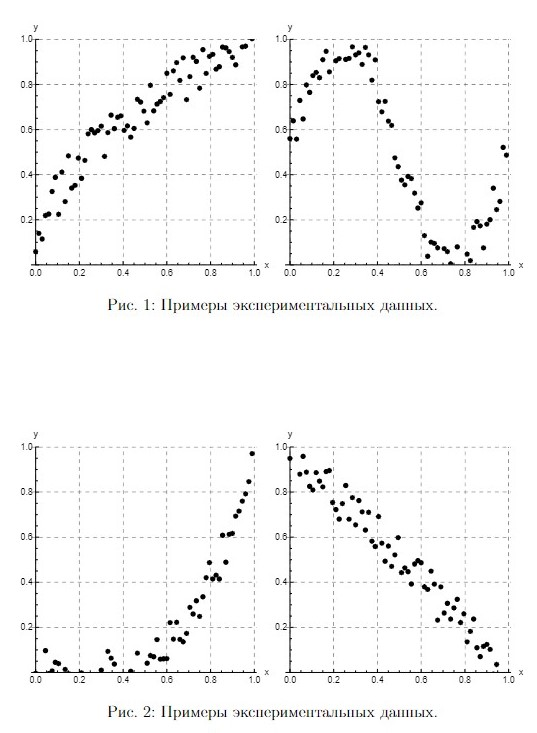
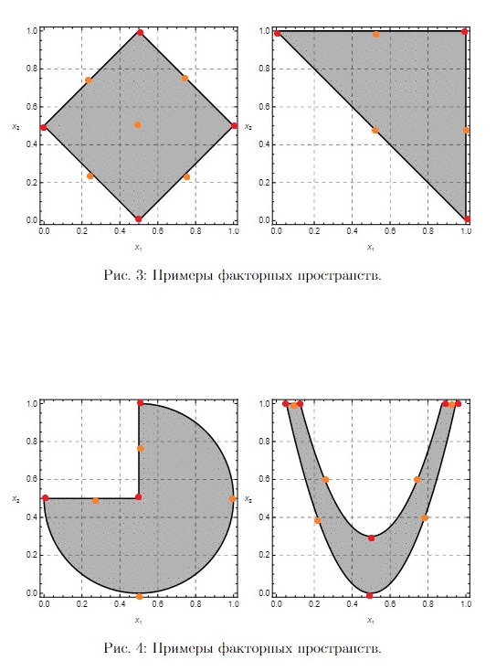

# Лабораторная №1

**Отклик** - наблюдаемая случайная переменная, по предложению зависящая от факторов

**Функция отклика** - зависимость математического ожидания отклика от факторов

**Поверхность отклика** - геометрическое представление функции отклика

**Фактор эксперимента** - переменная величина, по предположению влияющая на результаты эксперимента

**Уровень фактора** - фиксированное значение фактора относительно начала отсчёта

**Факторное пространство** - пространство, координатное оси которого соответствуют значениям факторов (множество внешних и внутренних параметров модели. значения которых исследователь может контролировать в ходе подготовки и проведения эксперимента)

**Свойства факторного пространства**:
1. aaa

**Корреляция** - 

**Метрика в пространстве** - задаёт расстояние на пространстве

Примеры:
1. французкая почтовая метрика
2. для слов - расстояние левенштейна, метрика пространств разреженных точек

**Метрическое пространство** - множество вместе со способом измерения расстояния между его элементами. Пара $(M, d)$ из множества $M$ и функции (метрики) $d: M \times M \rarr \R$ из его декартова квадрата в множество вещественных чисел называется метрическим пространством, если:
1. $d(x, y) = 0 \leftrightarrow x = y$ - **аксиома тождества**
2. $d(x, y) \geq 0$ - **аксиома положительности**
3. $d(x, y) = d(y, x)$ - **аксиома симметричности**
4. $d(x, z) \leq d(x, y) + d(y, z)$ - **аксиома треугольника или неравенство треугольника**

- $M$ - подлежащее множество или носитель метрического пространства
- $d$ - метрика или функция расстояния
- Элементы $M$ - точки метрического пространства

**Являются ли следующие функции метриками в соответствующих пространствах по Вашему определению**:
1. $\forall p,q \in \R: d(p, q) = |p - q|$ - да
2. $\forall p,q \in \R^2: d(p, q) = \sqrt{(p_x - q_x)^2 + (p_y - q_y)^2}$ - да
3. $\forall p,q \in \R^2: d(p, q) = |p_x - q_x| + |p_y - q_y|$ - да
4. $\forall p,q \in X: d(p, q) = 0, if p = q, 1, if p \neq q$ - да

**Может ли факторное пространство не быть метрическим?** - не может, если факторное пространство не метрическое, то 

**Может ли факторное пространство иметь разрывы?** - может иметь разрывы, если в нём присутствуют независимые факторы

**Нормализация фактора** - преобразование натуральных значений факторов в безразмерные значения

**Нормализуйте факторы**:
1. $x, x \in [-2, 3]$\
$x_n = \displaystyle\frac{x - x_0}{I}, x_0 = \displaystyle\frac{x_{max} - x_{min}}{2} \rArr x_n = \displaystyle\frac{x - \displaystyle\frac{x_{max} + x_{min}}{2}}{\displaystyle\frac{x_{max} - x_{min}}{2}}$\
$x = -2, x_n = \displaystyle\frac{-2 - \frac{1}{2}}{\frac{5}{2}} = -1$\
$x = 3, x_n = \displaystyle\frac{3 - \frac{1}{2}}{\frac{5}{2}} = 1$
1. $x, x \in [4, \infty)$\
$x_n = \displaystyle\frac{2}{\pi}\arctg(\log(x - 4))$\
при $x \rarr 4, \log(x - 4) \rarr -\infty, \frac{2}{\pi} \arctg (\log (x - 4)) = \frac{2}{\pi} \cdot (-\frac{2}{\pi}) = -1$\
при $x \rarr \infty, \log(x - 4) \rarr +\infty, \frac{2}{\pi}(\log(x - 4)) = \frac{2}{\pi} \cdot \frac{2}{\pi} = 1$

**Априорное ранжирование факторов** - метод выбора наиболее важных факторов, основанный на экспертной оценке

**Область экспериментирования** - область факторного пространства, где могут размещаться точки, отвечающие условиям проведения опытов

**Активный эксперимент** - эксперимент, при котором уровни факторов в каждом опыте задаются исследователем

**Пассивный эксперимент** - эксперимент, при котором уровни факторов в каждом опыте регистрируются исследователем, но не задаются

**Требуется экспериментальным путём определить зависимость некоторой величины от подаваемого на вход системы $x, x \in [0,1]$. Разовое взаимодействие с системой занимает 1 сутки. Попробуйте сравнить четыре плана эксперимента:**
1. $x = 0, 1, 0.5, 0.25, 0.75, 0.125, 0.625, 0.375, 0.875, ...$ - самый эффективный план, позволяет как можно быстрее выявить основные зависимости между x и выходным данным
2. $x = 0, 0.001, 0.002, 0.003, 0.004, 0.005, 0.006, ...$  - неэффективен, при ограниченном времени выявит зависимости со стороны 0
3. $x = 1, 0.999, 0.998, 0.997, 0.996, 0.995, 0.994, ...$ - неэффективен, при ограниченном времени выявит зависимости со стороны 1
4. $x = 0, 0.010, 0.005, 0.020, 0.015, 0.030, 0.025, ...$ - аналог 2 плана, лучше так как берёт точки и промеждуточные значения между ними, но всё равно в итоге выявляет зависимости только со стороны 0

**План эксперимента** - совокупность данных, определяющих число, условия и порядок реализации опытов

**Рандомизация плана** - один из приёмов планирования эксперимента, имеющий целью свести эффект некоторого неслучайного фактора к случайной ошибке

**Цели планирования эксперимента** - две цели:
1. сокращение общего объёма испытаний при соблюдении требований к достоверности и точности их результатов
2. повышение информативности каждого из экспериментов в отдельности

**Стратегическое планирование** - такая постановка задачи планирования, что из всех допустимых требуется выбрать такой план, который позволил бы получить наиболее достоверное значение функции отклика при фиксированном числе опытов

**Тактическое планирование** - такая постановка задачи планирования, что из всех допустимых требуется выбрать такой план, при котором статистическая оценка функции отклика может быть получена с заданной точностью при минимальном объёме испытаний

**Метод наименьших квадратов** - Пусть есть n наблюдаемых значений выходного параметра $y$ от входного параметра $x$. Предполагается, что зависимость входного параметра $x$ задаётся функцией:

$y = f(x,b)$

где - $b$ - вектор параметров

Вид функции $f$ известен (выбран). Требуется получить значения параметров из вектора $b$ так, чтобы отклонения графика искомой функции $f$ было минимальным от экспериментальных значений.

В **МНК** данная задача решается путём минимизации суммы квадратов отклонений $\Delta y_i = f(x_i, b) - y_i$, т.е. 
$$
S(b) = \sum_{i=1}^n (\Delta y_i)^2 = \sum_{i=1}^n [f (x_i, b) - y_i]^2 \rightarrow min (1)
$$

Взяв частные производные и приравняв их к 0 (необходимый признак экстремума функции нескольких переменных) из $(1)$ получаем систему уравнений $\frac{\delta S}{\delta b_i} = 0$, решив которую получаем значения искомых параметров b.

**Допускается ли построение с помощью МНК квадратичной модели по n точкам?** - допускается, но количество точек должно быть больше  или равно трём, иначе у полученных в МНК уравнений не будет решения (по двум и менее точкам нельзя однозначно построить параболу)

**Как можно определить, какая из двух построенных с помощью МНК аппроксимаций точнее отражает зависимость выходных данных от входных?**: для определения точности необходимо сравнить суммы квадратов отклонений и выбрать ту аппроксимацию, у которой сумма меньше (были ответы про коэффициент достоверности - чем ближе к 1, тем лучше и по ошибке аппроксимации - чем меньше, тем лучше)

**Для чего может быть использован график зависимости полученных средних значений функции отклика от входных данных?** - для оценки адекватности модели (с помощью оценки погрешности относительно реальных данных)

**Допустимо ли на основе двух графиков утверждать, какая из реляционных моделей лучше?** - Для утверждения того, что одна модель лучше другой, необходимо оценить значения среднеквадратичной ошибки $S = \sum_{i=1}^n [f(x_i) - y_i]^2$, где $x_i$ - значение входного параметра и $i$-ом опыте, $y_i$ - соответствующее экспериментальное значение выходного параметра, $f(x)$ - оцениваемая модель.

Регрессионная модель $f$ лучше модели $g$, если значение ошибки $S_f$ модели $f$ меньше ошибки $S_g$ модели $g$.

В случае с графиками утверждать что одна модель лучше другой можно только при условии, что можно визуально оценить разницу между значениями среднеквадратичной ошибки. Если визуально оценить невозможно, следует выполнить вычисления.

**Как решается вопрос с видом уравнения регрессии при проведении пассивного и активного экспериментов?** - при пассивном планировании вид уравнения регресии определяется по характеру изменения переменных на графике эмпирической линии регресии, полученной по выборке экспериментальных данных. В активном эксперименте если наблюдается линейная зависимость между входными и выходными переменными, то используются планы 1-го порядка для построения линейной модели - ПФЭ или ДФУ. Если наблюдается нелинейная зависимость, то используются планы второго порядка - ОЦКП.

**Какой режим работы системы интересует исследователя? Каковы условия существования стационарного режима?** - исследователя интересует стационарный режим работы, стационарный режим работы заключается в том, что уровни факторов исследуемой системы сходятся к определённому диапазону значений. В контексте первой лабораторной работы - очередь не растёт беконечно, интервал загрузки от 0 до 1, время ожидания не растёт бесконечно.

**Каковы результаты ЛР №1 и как они используются в последующих работах?**:
1. Смогли увидеть форму зависимости  ипри какиз значениях стационарный режим работы
2. За счёт граффика определяется вид уравнения регрессии (Уравнение регрессии - функциональная связь, при которой по любому значению x можно однозначно определить значение y)

**Предложите алгоритм разработки регрессионной модели, если предполагается, что она заведомо относится к полиномиальным.** -  для полиномиальной модели от одной переменной $f(x) = b_0 + \sum_{i=1}^{k} b_i x^i$, то, воспринимая степени $x_i$, как независимые факторы для каждого $i$ можно оценить параметры модели исходя из общей формулы оценки параметров линейной модели. Для этого учитывается, что $x_{ti} x_{tj} = x_t^i x_t^j = x_t^{i + j}$ и $x_{tj} y_j = x_t^j y_t$. 

Матричное представление линейной модели имеет вид: $y = Xb + \epsilon$, вектор оценок переменной и вектор ошибок будут иметь вид:
$$
\hat{y} = Xb, e = y - \hat{y} = y - Xb
$$
сумма квадратов остатков регресси:
$$
RSS = e^T e = (y - Xb)^T (y - Xb)
$$
После дифференцирования по вектору параметров $b$:
$$
(X^T X)b = X^T y
$$

[источник](https://ru.wikipedia.org/wiki/%D0%9C%D0%B5%D1%82%D0%BE%D0%B4_%D0%BD%D0%B0%D0%B8%D0%BC%D0%B5%D0%BD%D1%8C%D1%88%D0%B8%D1%85_%D0%BA%D0%B2%D0%B0%D0%B4%D1%80%D0%B0%D1%82%D0%BE%D0%B2)

Для полиномиальной модели:
$$
\begin{pmatrix}
    n & \sum_n x_t & ... & \sum_n x_t^k \\
    \sum_n x_y & \sum_n x_t^2 & \sum_n x_y^{k+1} \\
    ... & ... & ... & ... \\
    \sum_n x^k_y & \sum_n x_t^{k+1} & ... & \sum_n x_t^{2k}
\end{pmatrix}
\begin{bmatrix}
    b_0 \\
    b_1 \\
    ... \\
    b_k
\end{bmatrix} = 
\begin{bmatrix}
    \sum_n y_t \\
    \sum_n x_t y_t \\
    ...\\
    \sum_n x_t^k y_t
\end{bmatrix}
$$

**Предложите алгоритм разработки регрессионной модели для наборов экспериментальных данных, привёденных на рисункаx 1 и 2.**
1. полиномиальная регрессия
2. тригонометрическая регрессия
3. экспоненциальная регрессия
4. линейная регрессия

Алгоритм:
1. подбор вида функции
2. вычисление неизвестных коэффициентов функции (например с помощью МНК)

**Предложите план эксперимента для факторных пространств, изображённых на рисункаx 3 и 4. Как изменятся предложенные Вами планы эксперимента, если станет известна априорная оценка важности факторов?** - 

**Предложите алгоритм составления функции отклика для системы, имеющей более одного выходного данного.** - каждое выходное данное (также как и входное) имеет свой диапазон значений и разменость, поэтому следует ввести некоторую безразмерную шкалу, к которой будут приведены значения каждого выходного данного, что позволит сделать их сравнимыми.

Производить одновременную оптимизацию по нескольким выходным данным. Данная математическая задача является достаточно сложной. Для упрощения можно ввести обощенный параметр оптимизации, в качестве которого использовать некоторое среднее, например среднее геометрическое преобразованных значений выходов, средне квадратическую ошибку при условии наличия для каждого выхода некоторого идеального значения или средневзвешенную оценку при разной значимости выходных данных.

# Лабораторная №2

**Дайте определение полному факторному эксперименту (ПФЭ).** - полный факторный эксперимент это эксперимент, в котором реализуются все возможные сочетания уровней факторов.

**Относится ли полный факторный эксперимент (ПФЭ) к классу пассивных или активных экспериментов?** - ПФЭ относится к классу активных экспериментов, так как для ПФЭ составляется план эксперимента.

**Каково минимальное количество опытов в рамках проведения ПФЭ?** - $n = 2^m$, $m$ - количество факторов, 2 - количество уровней факторов (-1 и 1), если линейная модель, то $n = 4 = 2^2$, так как линия строится по двум точкам
 
**Как рассчитать количество экспериментов в ПФЭ?** - 

**При каком количестве факторов применим ПФЭ?** - так как ПФЭ работает за счёт построения комбинаций факторов, то его строит применять, когда факторов не очень много

**От чего зависит количество экспериментов?** - количество экспериментов зависит от количества факторов

**Каково минимальное количество опытов для построения линейной регрессионной модели?** - в случае линейной регрессионной модели при количестве факторов $k$ для проведения полного факторного эксперимента нужно $N = 2^k$ опытов, где $2$ - число уровней, которого достаточно для построения линейной модели.

**Являются ли результаты ПФЭ избыточными при построении линейной модели? Какие модели можно построить, исходя из данных ПФЭ?** - Линейная модель имеет вид $y = b_0 + b_1 x_1 + ... + b_k x_k$, то есть для неё требуется определение $k + 1$ коэфициентов. Для ПФЭ количество опытов, а следовательно числов уравнений, должно составить $N = 2^k$. Если $2^k > k + 1$, то ПФЭ избыточен для построения линейной модели.

Из данных ПФЭ можно построить более сложную модель, учитывающую взаимодействие факторов. Для двух факторов она имеет вид: $y = b_0 + b_1 x_1 + b_2 x_2 + b_{12} x_1 x_2$.

**Для чего могут быть использованы избыточные результаты ПФЭ?** - Избыточные результаты ПФЭ могут быть использованы:
1. для проведения усреднения коэфициентов путём переноса начала координат в точку с координатами, соответствующими средним значениям факторов. Тогда коэфициент $b_0$ - уреднение всех значений $y_i$, значение которого более устойчиво;
2. для оценки погрешности по отклонениям экспериментальных данных относительно построенной модели;
3. проверки адекватности модели.

**Что характеризуют коэффициенты регрессионной модели?** - силу и характер влияния факторов на конечный результат а также взаимодействие факторов между собой.

**Какая информация из предшествующего пассивного эксперимента может быть использована при проведении активного эксперимента?** - форма зависимости и при каких значениях модель работает в стационарном режиме.

**Каково значение отклика в нуле факторного пространства?** - в нуле факторного пространства функция отклика равна свободному члену (коэффициент $a_0$)

**Укажите свойства матрицы коэффициентов регрессии.** - 
1. ротабельность
2. ортоганальность

**Укажите свойства матрицы планирования.**
1. Симметричность матрицы относительно центра - $x_i = 0$, тогда $\sum_{i=1}^N x_{ji} = 0$
2. $\sum_{i=1}^N x^2_{ij} = N$ - условие нормировки, то есть сумма квадратов элементов каждого столбца равна числу опытов
3. $\sum_{i=1}^N x_{ij} \cdot x_{in} = 0$ - совокупность столбцов имеет следующее свойство, где $j \neq n$
4. Ротабельность - точки (уровни факторов) в матрице планирования подбираются так, что точность предсказания выходного параметра должна быть одинакова на равных расстояниях от центра эксперимента (нулевого уровня) и не зависеть от направления.

**Как коэффициенты вычисляются?** - сумма попарных произведений значений соответствующих $x$ и $y$, делённая на количество опытов.

**Как влияют свойства матрицы коэффициентов регрессии на проведение эксперимента?**:
1. ортогональность позволяет оценить все коэффициенты уровня регресии, независимо друг от друга
2. ротабельность позволяет обеспечить минимальную дисперсию коэффициентов регрессии и равеносто дисперсий

# Лабораяторая №3

**Дайте определение дробному факторному эксперименту.**

**Дайте определение генерирующему соотношению и дробной реплике.**

**Дайте определение определяющему контрасту и схемам смешивания.**

**Что должно быть определено в первую очередь: генерирующие соотношения или определяющий контраст?**

**Можно ли выбрать точки без генерирующих соотношений?**

**Что нам нам даёт ортогональность матрицы планирования?**

**Как связаны дробность плана и число членов уравнения?**

**Как связаны дробность плана и количество генерирующих соотношений?**

**Возможен ли ДФЭ для ПФЭ без избыточности?**

**Как найти обобщающий определяющий контраст?**

**Как с помощью обобщающего определяющего контраста найти степень взаимодействия факторов?**

# Лабораяторая №4

**Дайте определение ортогональному центральному композиционному планированию (ОЦКП), ядру, центру и звёздным точкам оного.**

**Что является ядром ОЦКП? Какие ДФЭ могут быть ядром ОЦКП?**

**Какие дробные реплики могут быть ядром ОЦКП?**

**Реплики можно дробить до бесконечности при увеличении количества факторов?**

**Почему парные взаимодействия не должны смешиваться?**

**Всегда ли хорошо, что парные взаимодействия смешаны друг с другом?**

**Сколько парных взаимодействий будет при 𝑛 факторах?**

**Можно ли для получения нелинейной модели использовать ПФЭ?**

**Почему тогда мы используем ОЦКП, а не ПФЭ?**

**Сколько уровней вариации в ОЦКП?**

**Опишите алгоритм планирования эксперимента с установкой без априорной информации, используя ДФЭ, ПФЭ и ОЦКП.**

**Откуда берутся 𝛼 и 𝑆 и зачем они нужны?**

**Где располагаются звёздные точки? Дайте определение звёздному плечу.**

**От чего зависит звёздное плечо?**

**Является ли план ОЦКП ротатабельным? За счёт чего его можно сделать ротатабельным?**

**На чем должны лежать точки для ротатабельности?**

**Может ли ротатабельный план быть ортогональным?**

# Misc

Для чего нужно ядро ОЦКП - при большом количестве данных можно взять полином порядка p (y = 1) получить дельту, получить b0 при старшем члене, если дельта достатончо мала, то стоп, иначе p = p+1 и в начале цикла
